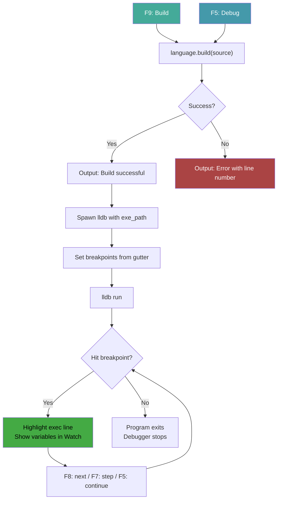
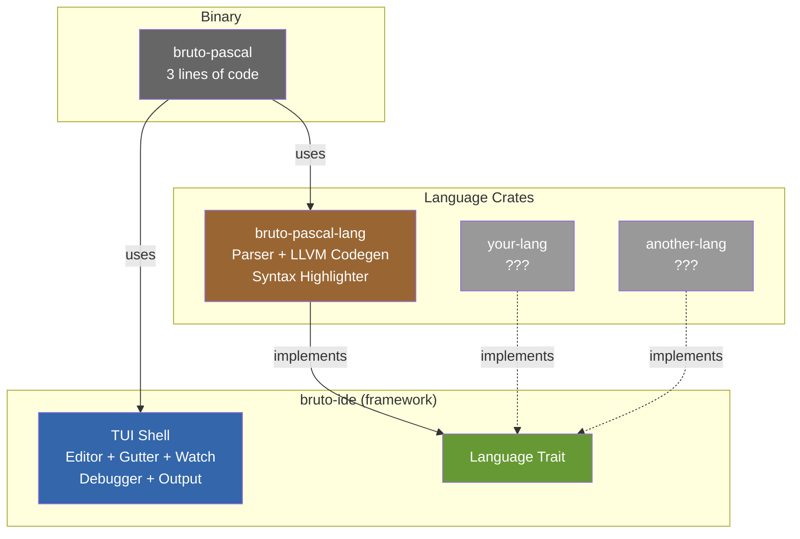

[Illustration: generate a landscape oriented image of a vintage computing lab with a glowing CRT monitor displaying colorful text-mode interface with blue and gray windows, a mechanical keyboard in the foreground, circuit boards and retro computing manuals scattered on the desk, warm tungsten lighting casting long shadows, photographic style, shallow depth of field focused on the screen]

# Bruto IDE: A Composable TUI Development Environment Built on Turbo Vision for Rust

## Bringing back the Borland experience, one crate at a time

There's something deeply satisfying about text-mode interfaces. They boot instantly, they render at terminal speed, and they carry the focused energy of an era when every pixel on screen existed for a reason. Borland's Turbo Pascal IDE defined that era for an entire generation of developers. Blue windows, gray dialogs, function key shortcuts along the bottom, a menu bar at the top. You typed code, pressed F9, and watched your program compile and run. No webpack. No hot reload. No twelve layers of tooling between your intent and execution.

Bruto IDE is an attempt to recapture that directness while solving a modern problem: what does it take to build a pluggable, composable TUI development environment in Rust? The answer, it turns out, involves three crates, a language trait, an LLVM backend, and a surprising number of terminal rendering bugs that needed fixing along the way.

This is version 0.1.0. That version number is honest. The foundations are laid, the architecture is deliberate, but the edges are rough and the feature set is minimal. What exists today is a working Pascal IDE that compiles and debugs real programs. What matters more is the shape of the thing: the separation between the IDE framework and the language it hosts.

## The architecture: three crates, one trait

The project splits into three independent repositories, each published as its own crate. This separation is the core design decision and everything else follows from it.

**bruto-ide** is the framework. It provides the TUI shell: an editor window with a breakpoint gutter, a watch panel for variable inspection, an output panel, menu bar, status line, and the full debugger integration with lldb. It knows nothing about Pascal or any other language. What it knows is how to take source text, hand it to something that can compile it, and then debug the result. That "something" is defined by a trait:

```rust
pub trait Language {
    fn name(&self) -> &str;
    fn file_extension(&self) -> &str;
    fn sample_program(&self) -> &str;
    fn create_highlighter(&self) -> Box<dyn SyntaxHighlighter>;
    fn build(&self, source: &str) -> Result<BuildResult, String>;
}
```

Five methods. That's the entire contract between the IDE and a language implementation. `name()` and `file_extension()` handle cosmetics: window titles, the About dialog. `sample_program()` provides the initial content loaded into the editor on startup, giving new users something to immediately build and run. `create_highlighter()` returns a turbo-vision `SyntaxHighlighter` that tokenizes source lines for syntax coloring. And `build()` does the heavy lifting: it takes raw source text and produces a `BuildResult` containing paths to the compiled executable, the source file on disk (needed for DWARF debug info resolution), and a console capture file where the program writes its output.

The `BuildResult` struct deserves attention because it encodes a deliberate architectural choice:

```rust
pub struct BuildResult {
    pub exe_path: String,
    pub source_path: String,
    pub console_capture_path: String,
}
```

The IDE doesn't care how the executable was produced. It could be LLVM, it could be Cranelift, it could be a shell script that calls `gcc`. The IDE just needs the path to something it can hand to lldb. The `source_path` exists because lldb needs the actual source file on disk to resolve DWARF line references and display source context during debugging. And `console_capture_path` solves a problem that took several iterations to get right: when a program runs under lldb with piped stdin/stdout, its output doesn't reliably appear in the debugger's stdout stream. The solution is to have the compiled program write its output to a known file via compiled-in `fprintf` calls, and the IDE tails that file in a separate thread.

**bruto-pascal-lang** implements the `Language` trait for a subset of Pascal. It contains a hand-written recursive descent parser, an LLVM code generator built on inkwell, and a syntax highlighter. The parser handles `program`/`var`/`begin`/`end` structure, `if`/`then`/`else`, `while`/`do`, `writeln`/`readln`, arithmetic with proper precedence, comparisons, and boolean operators. Every AST node carries a source `Span` with line and column numbers, and the code generator attaches DWARF metadata to every instruction so that lldb can set breakpoints on any statement line, including `end` keywords.

**bruto-pascal** is the binary. It's three lines of Rust:

```rust
fn main() -> turbo_vision::core::error::Result<()> {
    bruto_ide::ide::run(Box::new(bruto_pascal_lang::MiniPascal))
}
```

Create a language implementation, pass it to the IDE runner, done. If you wanted to build a BASIC IDE, or a Lua IDE, or an IDE for a language you invented last Tuesday, you'd write your own `Language` impl and swap that one line.

## What the IDE actually does

The IDE provides the classic Borland workflow. You see an editor with syntax highlighting, a watches panel on the right, and an output panel at the bottom. The menu bar offers File, Build, Debug, and Help menus. The status line shows F5 Debug, F7 Step, F8 Next, F9 Build, Alt-X Exit.

Press F9 and the IDE extracts the source text from the editor, calls `language.build()`, and reports success or failure in the Output panel. Errors include line numbers from the parser or code generator. Press Ctrl+F9 and it builds then runs, capturing the program's output in the same panel.

The debugger is where things get interesting. Click the single-column gutter to the left of the editor to place a red square breakpoint marker. Press F5 and the IDE builds the program, spawns an lldb subprocess, sets breakpoints at the marked lines, and runs. When execution hits a breakpoint, the current line gets a green background highlight across the editor, and the watch panel populates with local variable values parsed from lldb's `frame variable` output. F8 steps over, F7 steps into, F5 continues.



The debugger communication is entirely pipe-based. The IDE writes commands to lldb's stdin and reads responses from stdout via a dedicated reader thread feeding an `mpsc` channel. Program output travels through a separate file channel (the `console_capture_path` from `BuildResult`), read by another thread that polls the file for new bytes. This clean separation means program output never mixes with lldb's command responses, regardless of what the program prints. No content-based filtering, no heuristic parsing of "is this line from the program or from lldb." The streams are physically separate.

## Turbo Vision for Rust: finding and fixing the bugs

Building Bruto IDE served as a serious stress test for the Turbo Vision for Rust framework, and the process surfaced real bugs that needed fixing upstream.

The most instructive was a rendering bug in the terminal's diff-based flush system. Turbo Vision maintains two buffers: the current frame and the previous frame. On each flush, it only sends cells that changed, which is essential for performance over SSH and slow terminals. The `force_full_redraw()` method exists to invalidate the previous buffer and force every cell to be resent. It filled `prev_buffer` with `Cell(' ', Attr::from_u8(0x07))`, which decodes to a space character with a LightGray-on-Black color attribute. The problem: that's the exact same cell value that many views use for empty space. The `TerminalWidget`, for instance, fills unused rows with spaces in LightGray on Black. The diff saw `buffer == prev_buffer` and silently skipped those cells, leaving stale content from earlier draw passes visible on screen. The fix was a one-line change: use `Cell('\0', Attr::from_u8(0xFF))` as the sentinel value instead, matching what the `resize()` method already used. A null character with an impossible attribute value that no real view will ever produce.

Another fix addressed the `TerminalWidget`'s hardcoded background color. It used `colors::EDITOR_NORMAL` (LightGray on Blue) as the default for empty rows, which made sense when the widget lived inside a blue Window but produced jarring results inside a Dialog with a gray palette. The fix changed the default to LightGray on Black, which matches the expected terminal aesthetic.

These fixes shipped as turbo-vision 1.0.3. Finding them required building something real on top of the framework, something with multiple windows, different palette types, and a view hierarchy complex enough to expose the interaction between Frame interior fills, Group clipping, and terminal buffer diffing. Unit tests wouldn't have caught this. You needed the full stack running in a real terminal to see the green rectangles where black should have been.

## The palette system: what works and what doesn't

Turbo Vision's color system is a three-level mapping chain inherited from Borland's original design. A view has a palette that maps logical color indices to its parent's indices. The parent (a Window or Dialog) has a palette that maps those to application-level indices. The application palette contains the actual RGB color attributes. When a view calls `map_color(1)`, the index cascades through the chain until it resolves to a concrete foreground/background pair.

The Rust implementation simplifies this. Instead of traversing the actual owner chain through pointers (which would require unsafe Rust), it checks the view's `OwnerType` enum (Window, Dialog, CyanWindow, or None) and applies the corresponding hardcoded palette. This means overriding `get_palette()` on a custom Window subclass doesn't affect child views, because children don't look at their parent's palette; they look at their `OwnerType` and use the built-in constant for that type.

For Bruto IDE, this meant that the output panel's background couldn't be changed by overriding the Window palette. The solution was straightforward: use a Dialog instead of a Window (Dialogs have a gray palette that looks more neutral), and ensure the TerminalWidget inside uses explicit color attributes on every line rather than relying on palette-mapped defaults. It's not elegant, but it works, and it reveals where the framework's palette abstraction could be strengthened in future versions.

## What 0.1.0 means

Version numbers communicate expectations. 0.1.0 means the architecture is established but the implementation is incomplete. Specific limitations worth knowing about:

The editor is turbo-vision's built-in `Editor` component. It handles text editing, undo/redo, search, clipboard operations, and syntax highlighting. But File > Open and File > Save aren't wired up yet. The editor always starts with the language's sample program. There's no file persistence.

The Pascal language subset is deliberately minimal. No procedures or functions, no arrays, no records, no nested scopes. The grammar handles enough to write interesting programs with loops, conditionals, and I/O, but it's not Standard Pascal by any stretch.

The debugger works but relies on parsing lldb's text output, which is inherently fragile across lldb versions. Variable display shows the raw lldb format (`(long) x = 42`) without type translation.

The gutter supports breakpoints and execution line display, but scroll synchronization between the gutter and editor relies on reading the vertical scrollbar's value, which works but could drift in edge cases.

None of these are architectural problems. They're implementation gaps that can be filled without restructuring anything. The trait boundary is clean. The crate separation is real. The debugger protocol is encapsulated. Adding file I/O, expanding the grammar, improving variable display: these are all local changes within well-defined boundaries.

## Running it yourself

You need LLVM 18 and a Rust toolchain with edition 2024 support:

```bash
brew install llvm@18
git clone https://github.com/aovestdipaperino/bruto-pascal
cd bruto-pascal
LLVM_SYS_181_PREFIX=/opt/homebrew/opt/llvm@18 cargo run
```

The IDE starts with a sample Pascal program that sums the integers from 1 to 10. Click the gutter to set a breakpoint, press F5 to debug, F8 to step through, and watch the variables update in real time. Press F9 to just build, Ctrl+F9 to build and run. Alt+X exits.

To implement your own language, create a crate that depends on `bruto-ide`, implement the `Language` trait, and call `bruto_ide::ide::run()` with your implementation. The IDE handles everything else: the TUI, the debugger, the event loop, the window management.

## What composability actually buys you

The split into three crates isn't just organizational tidiness. It enforces a real boundary. The IDE crate cannot import the parser. The language crate cannot reach into the debugger's internals. Changes to the Pascal grammar don't require recompiling the IDE. A new language implementation doesn't touch any IDE code.

This matters because TUI frameworks are fragile. Terminal rendering, keyboard handling, mouse events, palette management: these are surfaces where bugs hide and where changes ripple. By isolating the IDE shell from language-specific code, bugs in either domain stay contained. The terminal rendering fix that went into turbo-vision 1.0.3 was found while building the Pascal implementation, but the fix shipped in the framework crate where it benefits every application, not just this one.

It also means the project can grow in different directions independently. Someone could implement a BASIC language crate without understanding LLVM. Someone could improve the IDE's debugger integration without knowing anything about Pascal parsing. The trait boundary makes these contributions genuinely independent.



## The road from here

The immediate priorities are file I/O (so you can actually save your work), expanding the Pascal grammar with procedures and functions, and improving the debugger's variable display. Longer term, the IDE needs proper resize handling, configurable color themes, and better scroll synchronization between the gutter and editor.

But the most interesting direction is seeing what other languages people build on top of it. The trait is simple. The infrastructure is there. If you've ever wanted to build a TUI IDE for a language you care about, the hard parts (terminal management, debugger integration, window layout) are already solved. What you bring is the parser, the compiler, and the syntax highlighter. The IDE handles the rest.

Version 0.1.0. The foundations. Everything else builds on them.

---

Want more like this?
I write regularly about Rust, design patterns, and performance tips.
Follow me here [on Medium](https://enzolombardi.net) to stay updated.

*Rust* *TUI* *IDE Development* *LLVM* *Developer Tools*
